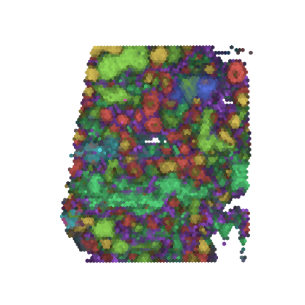

# chrysalis

<p align="center">
   
</p>

**chrysalis** is a visualization tool  built with the goal to generate neat and meaningful visual representation of spatial transcriptomics datasets (only 10X Visium is supported at the moment) based on spatially variable genes, leveraging PCA and Archetype Analysis. 

It is designed to seamlessly integrate into `scanpy` datasets using `anndata` objects.

<p align="center">
   
</p>

## Package
**chrysalis** designed to be as lightweight as possible, however it relies on `libpysal` for its fast implementation of Moran's I.

**chrysalis** requires the following packages before installation:
- asd
- asd

To install **chrysalis**:
```terminal
pip install chrysalis
```
## Usage

```python
import chrysalis as ch

adata = sc.datasets.visium_sge(sample_id=sample)
ch.calculate(adata)
ch.plot_aa(adata, pcs=8)
plt.show()

```
