<p align="center">
   
</p>

**chrysalis** is a visualization tool that generates neat and meaningful visual representations of spatial transcriptomics datasets. It achieves this by leveraging PCA, Archetype Analysis and spatially variable gene detection. Moreover, it seamlessly integrates into scanpy pipelines.

<p align="center">
   
</p>

By combining PCA with AA, **chrysalis** can define distinct tissue compartments and cellular niches, which can be highlighted with specific colors. For instance, on the V1_Human_Lymph_Node dataset, **chrysalis** can identify and highlight various regions, such as germinal centers (yellow), B cell follicles (dark orange), and T cell compartments (lime). You can find more examples in the gallery section.
<p align="center">
   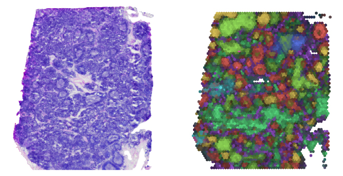
</p>

## Package
**chrysalis** can be used with any preexisting `anndata` snapshot of 10X Visium datasets generated with `scanpy`, and on new samples without the need of preprocessing. It is designed to be as lightweight as possible, however it relies on `libpysal` for its fast implementation of Moran's I.

**chrysalis** requires the following packages before installation:
- asd
- asd

To install **chrysalis**:
```terminal
pip install chrysalis
```
## Usage

```python
import chrysalis as ch

adata = sc.datasets.visium_sge(sample_id=sample)
ch.calculate(adata)
ch.plot_aa(adata, pcs=8)
plt.show()
```
`ch.calculate(adata)` stores some data under `adata.uns` allowing `ch.plot(adata)` to be called without the need of recalculating the embeddings every time if the `anndata` object is saved.

## Gallery

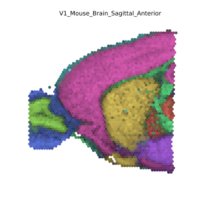
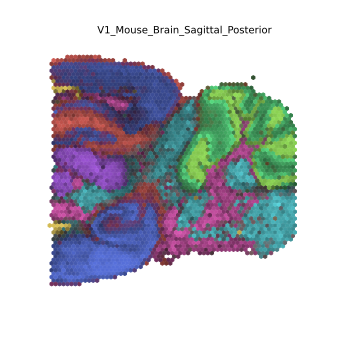
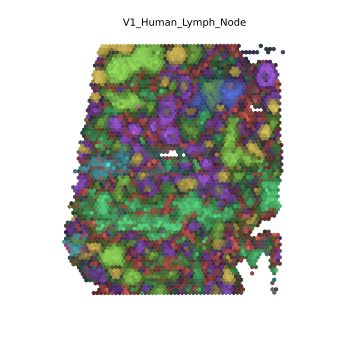


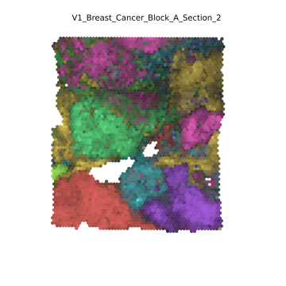

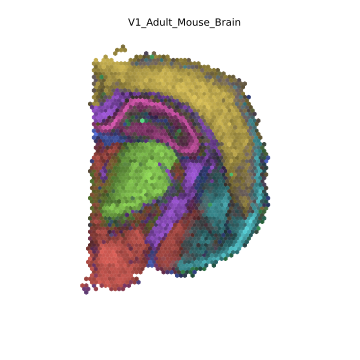
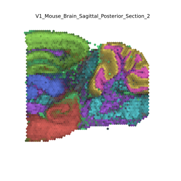


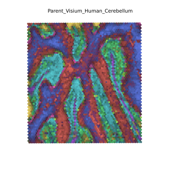

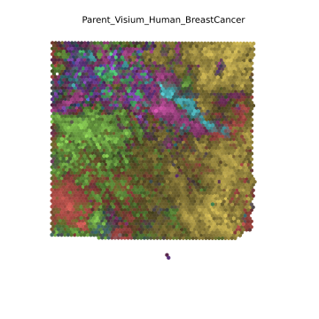
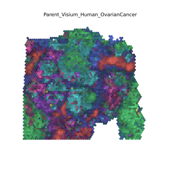
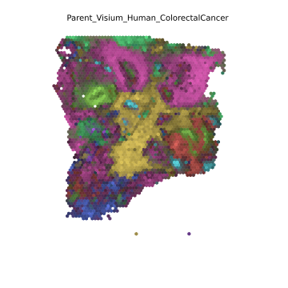
