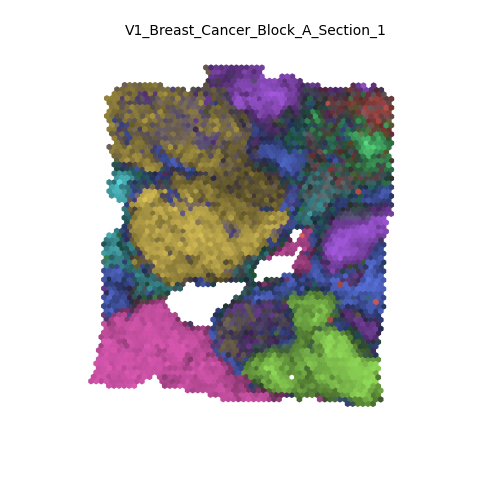

<p align="center">
   
</p>

**chrysalis** is a spatial domain detection and visualization tool that generates neat and meaningful visual representations of spatial transcriptomics datasets. It achieves this by leveraging PCA, archetypal analysis and spatially variable gene detection. Moreover, it seamlessly integrates into `scanpy` based pipelines.

<p align="center">
   
</p>

By combining PCA with AA, **chrysalis** can define distinct tissue compartments and cellular niches, which can be highlighted with specific colors. For instance, on the `V1_Human_Lymph_Node` dataset, **chrysalis** can identify and highlight various regions, such as germinal centers (yellow), B cell follicles (dark orange), and T cell compartments (lime). You can find more examples in the [gallery](https://github.com/rockdeme/chrysalis#gallery) section.
<p align="center">
   
</p>

## Package
**chrysalis** can be used with any pre-existing `anndata` snapshot of 10X Visium, Slide-seqV2 and Stereo-seq datasets generated with `scanpy`, and on new samples without the need of preprocessing. It is designed to be as lightweight as possible, however currently it relies on `libpysal` for its fast implementation of Moran's I.

**chrysalis** requires the following packages:
- numpy
- pandas
- matplotlib
- scanpy
- pysal
- archetypes
- scikit_learn
- scipy
- tqdm

To install **chrysalis**:
```terminal
pip install --index-url=https://test.pypi.org/simple/ --extra-index-url=https://pypi.org/simple/ chrysalis==1.4b0
```
If `rvlib` fails to install, you can try installing it with conda:
```terminal
conda install -c conda-forge rvlib 
```

## Usage

**UPDATE**: Please refer to `lymph_node_demo.ipynb` for the updated funcionality.

```python
import scanpy as sc
import matplotlib.pyplot as plt
from chrysalis.functions import chrysalis_calculate, chrysalis_plot

# download and read data
adata = sc.datasets.visium_sge(sample_id='V1_Human_Lymph_Node')
# calculate embeddings
chrysalis_calculate(adata)
# generate visualization
chrysalis_plot(adata)
plt.show()
```
`chrysalis_calculate(adata)` stores data under `adata.obsm` allowing `chrysalis_plot(adata)` to be called without the need of recalculating the embeddings every time if the `anndata` object is saved.

## Gallery





